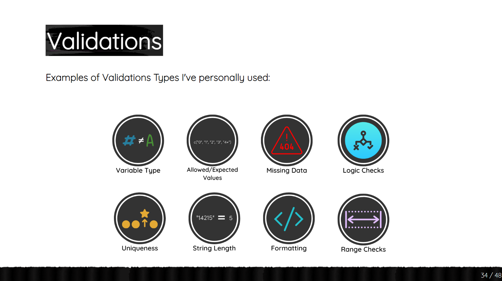

```{r setup, include=FALSE}
knitr::opts_chunk$set(echo = TRUE)
```

# Spotting messy data

> "Happy ~~families~~ *datasets* are all alike; every unhappy ~~family~~ *dataset* is unhappy in its own way."

-Leo Tolstoy (*Anna Karenina*), my edits in italics

<br>

## What can messy data look like?

Like Tolstoy implied (sort of), messy data can take one of infinite forms. I'll list a few ways as a warm-up:

1.  Data was entered manually, raising the likelihood of human error present.

-   There is an errant "51" in a column listing values from 1-10.

2.  Data is formatted in a subpar way from R's perspective.

-   There are two columns with the same name.
-   There are spaces in the column names.

3.  Multiple people collected data (or maybe one person over multiple years... definitely not me...), used different names or values for the same things, and merged their data into one file.

-   Missing values are labelled as "NA", "missing", 99, or left blank.
-   Dates recorded as "1/2/22", "2/1/22", "2/1/2022", "January 2, 2022", "1-2-2022"... dates can be a pain to tidy up!

Check out ["The Quartz guide to bad data"](https://github.com/Quartz/bad-data-guide) for an admirably comprehensive list of forms that messy data can take.

<br>

# Cleaning messy data

> "How do I ~~love~~ *clean* thee? Let me count the ways."

-Elizabeth Barrett Browning (*Sonnet 43*), my edits in italics

There are already wonderfully-written, comprehensive guides about cleaning and managing data. In contrast, my goal is to offer a few ideas I find especially important when it comes to data cleaning.

## Get a sense of the data itself (get that metadata!)

Ask yourself:

-   Who collected this data?

-   What do the rows and columns represent?

    -   Is each row an animal sighting, or a day's summary of animal sightings?
    -   What does the column "Mean" mean? Are there any units?

-   What do we expect to see vs. what is present?

    -   Is it truly realistic that 5 months' worth of data are missing, or might that signal that only a portion of the data was sent?

## Archive the original data

Before you go any further, **save a copy of the original data and do not touch it.** I like to save the original data in a folder called "data_raw". Once I'm done cleaning the data, I'll save the cleaned version in a folder called, "data_clean", then read in that data to be analyzed downstream.

## Clean up data within R

### Organize unruly column names

When [Jenny Bryan](https://www.youtube.com/results?search_query=jenny+bryan), R engineer and instructor extraordinaire, says something, it's a good idea to listen.

She explains how to name files well and why it's worthwhile to do so in her 2022 [NormConf](https://normconf.com/) [flash talk](https://youtu.be/ES1LTlnpLMk). While filenames and column names aren't identical, her talk is very relevant to this section about naming columns well. Especially this slide:

<center>

{width="900" height="430"}

</center>
*Alt text: A slide with bolded text: Pick a filename/ any convention/ Just pick one. There are two feet in the corner, each with an arrow above it pointing a different direction.*

Sometimes you have to clean data that contains columns with naming conventions as unique as snowflakes. Let's make a chaotic dataframe with data about the characters in Little Women and then clean it with the wonderful `janitor` package.

```{r eval=FALSE}
install.package("janitor")
```

```{r warning=FALSE, message=FALSE}
library(janitor)
library(magrittr) # load this to use pipes like this %>%
```

```{r}
little_women <- data.frame(
  # Characters' names
  characterNames = c("Jo", "Beth", "Amy", "Meg", "Timothee"),
  
  # Characters' ages
  áge = c(15, 13, 12, 16, 84),
  
  # Characters' ages in dog years
  'Age (Dog years)' = c(105, 91, 83, 112, 588),
  
  # Personality traits
  PERSONALITYTrait = c("impatient", "musical", "artistic", "responsible", NA),
  
  # An empty column like those commonly imported from Excel
  emptyROW = c(NA, NA, NA, NA, NA)
)
```

```{r}
head(little_women)
```

Now, clean those unruly column names with `janitor::clean_names()`:

```{r}
little_women %<>% 
  janitor::clean_names() %T>%
  print()
```

Now, our columns are easily read by both humans and machines. They are also named consistently, with a lowercase & snake_case convention (i.e., words are separated with underscores, \_).

### Remove empty and duplicate rows/columns

Let's use another `janitor` function, `remove_empty()`, to automatically remove columns and rows that are empty. I often encounter empty rows/columns when importing csvs from Excel.

```{r}
little_women %<>% 
  janitor::remove_empty(c("rows", "cols")) %T>%
  print()
```

One more function worth exploring from `janitor` is `get_dupes()`. This will alert us about any duplicate rows within our dataset.

First, duplicate each row:
```{r}
little_women %<>%
  dplyr::slice(rep(1:5, each = 2))
```

Then, ask get_dupes() to find them:
```{r}
janitor::get_dupes(little_women)
```

Finally, keep only unique rows:
```{r}
little_women %<>%
  unique() %T>%
  print()
```

## Explore the data

### Validate the data

This means making sure that your "Year" column contains values between 1900-2000, for example. Confirming that "Distance_meters" = "Distance_feet" x 0.3048.

Let's use the [`validate`](https://github.com/data-cleaning/validate) package.

First, install and load the package:

```{r eval=FALSE}
install.package("validate")
```

```{r warning=FALSE}
library(validate)
```

Next, validate that the dataset is set up properly:

Their names and traits should be of class "character". They're little women, so their ages should be below... let's say 20. Their ages in dog years should be equal to their age x 7.

```{r}
checks <- validator(class(character_names) == "character",
                 age < 20,
                 age_dog_years == age*7,
                 class(personality_trait) == "character")

# perform the validations
checked_lw <- validate::confront(little_women, checks)

# see a summary of the results
summary(checked_lw)
```

Here's what our summary says:

- Name: Name of each rule.
- Items: Number of items assessed per rule.
- Passes/Fails: Number of times the items passed vs. failed the rules. Passes + Fails = Items.
- Error/Warning: If, during the validation process, there was an error/warning.
- Expression: The expression used to check the rule.

We can see that our first and fourth rules were 1 for 1- i.e., the character_names and personality_trait columns were actually of the class "character" (good!). For rules 2 and 3, one item didn't pass the test each time. Indeed, the age of Timothee is not \< 20 and Amy's age in dog years isn't her real age x 7- it's slightly off.

We can even plot these results! Nifty, eh?

```{r}
plot(checked_lw)
```

We can also identify the entries that broke the rules.

Option 1: see entire data frame

```{r}
as.data.frame(checked_lw) %>%
# exclude entries 1 and 4 because they are spotless
   dplyr::filter(name != "V1" & name != "V4")
# then visually assess based on the "value" column's TRUE/FALSE.
```

Option 2: Let `validate` show us the "violating" rows
```{r}
violating(little_women, # original df
          checked_lw[2:3]) # evaluated df, filtered by rules w/violations that can be assessed per row.
```

Rules 2 and 3 were broken. If Rule 1 had been violated, this step wouldn't be possible/necessary because asking about a variable's class is something you ask once- you don't assess it on a row-by-row basis.

Check out other types of validations that [Meghan Harris](https://www.thetidytrekker.com/) covered in [her excellent presentation at RStudio::conf(2022)](https://meghansaha.github.io/pipelines_in_R/#34):

<center>

{width="900" height="430"}
</center>
*Alt text: A slide with the title, "Examples of Validations Types I've personally used". There are eight circles with different data validations: Variable type, allowed/expected values, missing data, logic checks, uniqueness, string length, formatting, range checks.*


### Summarize the data

Let's correct the values we flagged with `validate`, then look at a simple summary of the data.

```{r}
little_women[5, "personality_trait"] <- "angsty"
little_women[5, "age"] <- 15
little_women[5, "age_dog_years"] <- 15*7
little_women[3, "age_dog_years"] <- 12*7

summary(little_women)
```

The character columns' summaries offer information about the length, class, and mode of the column. For the numeric columns, we see quantitative summaries regarding max and mins, medians and means, 1st and 3rd quantiles. This is another way to find possible errors in the data.

Another easy way to get a sense of your data is to plot it.

### Plot the data

Let's use a much richer dataset from the `gapminder` package. I guess it deviates from this tutorial's literature theme, but hey, some of the great novels were written during the years included in this dataset!

```{r eval=FALSE}
install.package("gapminder")
```

```{r warning=FALSE, message=FALSE}
library(gapminder)
```

We'll save a local copy of the dataset, called "gap_data", then explore it.

```{r}
gap_data <- gapminder
str(gap_data)
head(gap_data)

```

This dataset contains information about the life expectancy, population, and GDP per capita for many countries over many years. How many countries? How many years?

First: how many countries?

```{r}
length(unique(gap_data$country)) 
```

How many continents?

```{r}
length(unique(gap_data$continent))
```

During which years?

```{r}
range(gap_data$year)
```

But only 12 years:

```{r}
length(unique(gap_data$year))
```

Specifically, these years. Two per decade, it appears:

```{r}
unique(gap_data$year) 
```

Let's explore the data visually. We can look for outliers, trends, and more to familiarize ourselves with the data. We'll start by using the base R scatterplot matrix function, `pairs()`, to plot all five variables in the dataset against one another.

```{r}
gap_data %>%
  pairs()
```

We can start to see some trends here, like that year and life expectancy seem to have a positive relationship. However, there's a lot of data here, and each country has many entries (12 years of data each). So let's filter a little, then replot.

We'll select Bolivia as the country and exclude the country and continent variables. We had to be very careful with those variables because they are categorical, not numeric, like the remaining variables.

```{r}
gap_data %>%
  dplyr::filter(country == "Bolivia") %>%
  dplyr::select(year, lifeExp, pop, gdpPercap) %>%
  pairs()
```

Very nice. Now we can see some trends more clearly, like that year, life expectancy, and population have pretty clear positive relationships. GDP per capita isn't as tightly correlated with these factors (the R squared value is likely lower), but it also looks like there's a positive relationship with the other variables.

If you had entered this data by hand, this plotting exercise could help point out that you'd entered 3000 instead of 2000 for year or had missed a few entries, for instance. It also informs you of the patterns you should expect, developing your instincts to spot errors before you get in too deep.

# Closing

*These are some of the key ideas I think about while cleaning data. What goes through your mind when you receive a new dataset? Do you have any favorite tips or tricks for familiarizing yourself with or cleaning the data? Feel free to let me know! There's always something new to learn!*